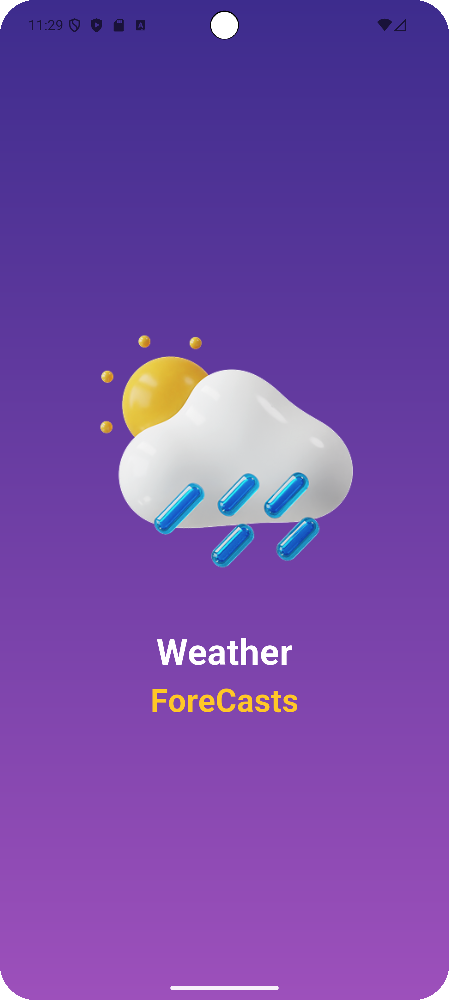
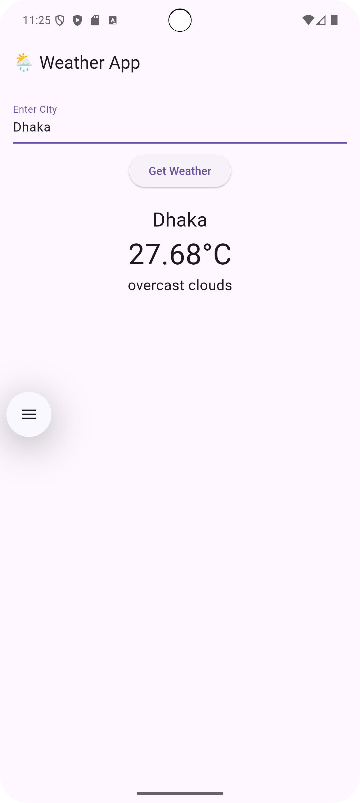

# 🌦️ Sample_Flutter_Weather_App

A simple and elegant Flutter weather application built using **GetX** for state management and navigation. This app fetches real-time weather data using the **OpenWeatherMap API**, includes a stylish **splash screen animation**, and demonstrates clean architecture with controller separation.

---

## 📱 Screenshots

<p align="center">
  
  

</p>


## 🚀 Features

- 🌐 Real-time weather info from [OpenWeatherMap](https://openweathermap.org/)
- 📦 GetX for state management, routing & DI
- 🎨 Clean UI with animation and gradient
- ⚡ Smooth transition from splash to main screen
- 📱 Responsive design with `SizeUtils` support
- 🔍 Error handling for invalid cities and network issues

---

## 🧱 Tech Stack

- **Flutter**
- **GetX**
- **HTTP package**
- **OpenWeatherMap API**

---

## 🛠️ Getting Started

### 1. **Clone the repository**

```bash
git clone https://github.com/TamimHq/Sample_Flutter_Weather_App.git
cd Sample_Flutter_Weather_App
```

### 2. **Install dependencies**

```bash
flutter pub get
```

### 3. **Add API Key**

Get your API key from [OpenWeatherMap](https://openweathermap.org/api), then open `weather_controller.dart` and replace:

```dart
final apiKey = 'YOUR_API_KEY';
```

with:

```dart
final apiKey = 'your_real_api_key';
```

### 4. **Run the app**

```bash
flutter run
```

---

## 🧪 Testing

To run widget tests:

```bash
flutter test
```

> Ensure `MyApp` or entry widget is correctly defined in `main.dart` and imported in `widget_test.dart`.

---

## 📂 Project Structure

```bash
lib/
├── main.dart
├── splash_screen.dart
├── weather_page.dart
├── controllers/
│   └── weather_controller.dart
│   └── splash_controller.dart
├── models/
│   └── weather_model.dart
├── widgets/
│   └── custom_image_view.dart
├── core/
│   └── utils/size_utils.dart
```

---

## 🌟 Contributing

Pull requests are welcome. For major changes, please open an issue first to discuss what you'd like to change.

---

## 📃 License

[MIT](LICENSE)

---

## 👤 Author

**Tamim Haque**  
🔗 [Your GitHub](https://github.com/TamimHq)  
📧 tamimhaque13@gmail.com

---

## 🙌 Acknowledgements

- [OpenWeatherMap API](https://openweathermap.org/)
- [GetX Package](https://pub.dev/packages/get)
- [Flutter](https://flutter.dev/)
